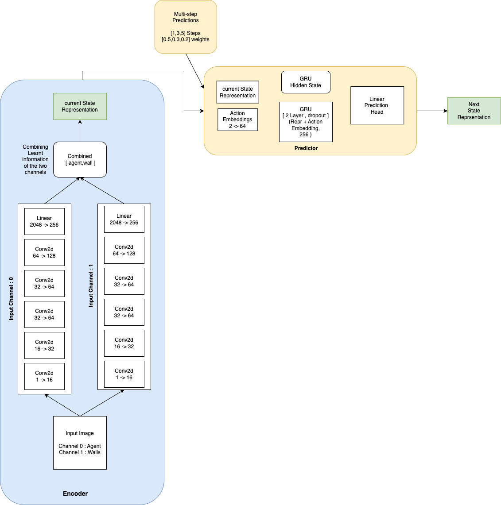
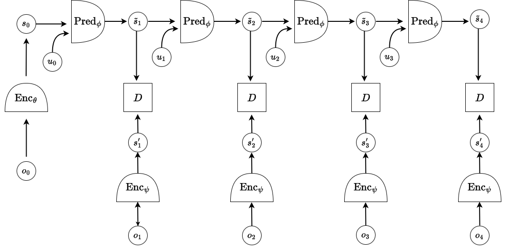
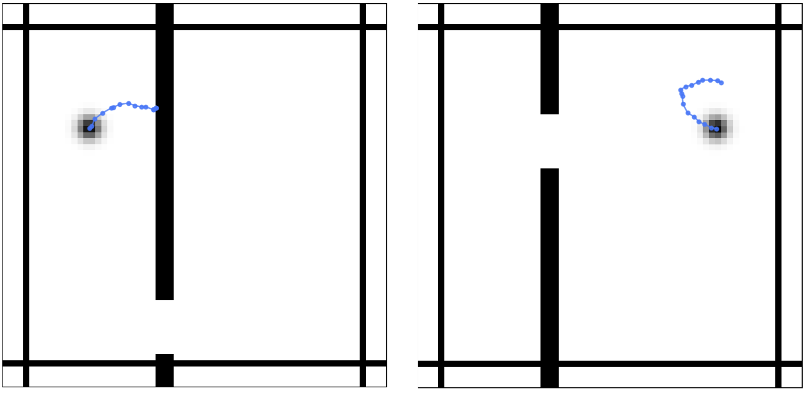

# Multi-Horizon self supervised latent state prediction using JEPA

## Overview

In this project, we train a JEPA world model on a set of pre-collected trajectories from a toy environment involving an agent in two rooms.

### Our approach

We process the input image through two parallel convolutional pathways: one dedicated to extracting features from the agent channel, and another for the wall configuration channel. 
The outputs from both streams are then concatenated and passed through a linear layer to create the state representation.


Here we enhance our original architecture for multistep prediction, the previous approach was designed to be accurate in one step ahead prediction at each point, here we try to enhance the model to be accurate on future horizons.

The models maintains and passes the GRU’s hidden state between the steps and allows the network build a memory of the trajectory and loss is applied as weight average towards being correct in the future trying to make learning more error.
Instead of comparing every prediction to its ground truth equally, we apply VICReg only at specific steps, with weights. At steps [1,3,5,] -> horizon weights [0.5,0.3,0.2]

probe_normal val loss: 2.036336898803711

probe_wall val loss: 5.650292873382568

wall_other val loss: 6.919018745422363

expert val loss: 7.305054187774658

trainable parameters of your model 1,885,632



simpler approach on [https://github.com/Tulsani/JEPA-MPC/tree/ftr/walls-dont-move]

### JEPA

Joint embedding prediction architecture (JEPA) is an energy based architecture for self supervised learning first proposed by [LeCun (2022)]. Essentially, it works by asking the model to predict its own representations of future observations.

More formally, in the context of this problem, given an *agent trajectory* $\tau$, *i.e.* an observation-action sequence $\tau = (o_0, u_0, o_1, u_1, \ldots, o_{N-1}, u_{N-1}, o_N)$ , we specify a recurrent JEPA architecture as:

$$
\begin{align}
\text{Encoder}:   &\tilde{s}\_0 = s\_0 = \text{Enc}\_\theta(o_0) \\
\text{Predictor}: &\tilde{s}\_n = \text{Pred}\_\phi(\tilde{s}\_{n-1}, u\_{n-1})
\end{align}
$$

Where $\tilde{s}_n$ is the predicted state at time index $n$, and $s_n$ is the encoder output at time index $n$.

The architecture may also be teacher-forcing (non-recurrent):

$$
\begin{align}
\text{Encoder}:   &s\_n = \text{Enc}\_\theta(o_n) \\
\text{Predictor}: &\tilde{s}\_n = \text{Pred}\_\phi(s\_{n-1}, u\_{n-1})
\end{align}
$$

The JEPA training objective would be to minimize the energy for the observation-action sequence $\tau$, given to us by the sum of the distance between predicted states $\tilde{s}\_n$ and the target states $s'\_n$, where:

$$
\begin{align}
\text{Target Encoder}: &s'\_n = \text{Enc}\_{\psi}(o_n) \\
\text{System energy}:  &F(\tau) = \sum\_{n=1}^{N}D(\tilde{s}\_n, s'\_n)
\end{align}
$$

Where the Target Encoder $\text{Enc}\_\psi$ may be identical to Encoder $\text{Enc}\_\theta$ ([VicReg](https://arxiv.org/pdf/2105.04906), [Barlow Twins](https://arxiv.org/pdf/2103.03230)), or not ([BYOL](https://arxiv.org/pdf/2006.07733))

$D(\tilde{s}\_n, s'\_n)$ is some "distance" function. However, minimizing the energy naively is problematic because it can lead to representation collapse (why?). There are techniques (such as ones mentioned above) to prevent this collapse by adding regularisers, contrastive samples, or specific architectural choices. Feel free to experiment.

Here's a diagram illustrating a recurrent JEPA for 4 timesteps:




### Environment and data set

The dataset consists of random trajectories collected from a toy environment consisting of an agent (dot) in two rooms separated by a wall. There's a door in a wall.  The agent cannot travel through the border wall or middle wall (except through the door). Different trajectories may have different wall and door positions. Thus your JEPA model needs to be able to perceive and distinguish environment layouts. Two training trajectories with different layouts are depicted below.




### Competition Task

Our task is to implement and train a JEPA architecture on a dataset of 2.5M frames of exploratory trajectories (see images above). Then, your model will be evaluated based on how well the predicted representations will capture the true $(x, y)$ coordinate of the agent we'll call $(y\_1,y\_2)$. 

Here are the constraints:
* It has to be a JEPA architecture - namely you have to train it by minimizing the distance between predictions and targets in the *representation space*, while preventing collapse.
* You can try various methods of preventing collapse, **except** image reconstruction. That is - you cannot reconstruct target images as a part of your objective, such as in the case of [MAE](https://arxiv.org/pdf/2111.06377).
* You have to rely only on the provided data in folder `/scratch/DL25SP/train`. However you are allowed to apply image augmentation.

**Failing to meet the above constraints will result in deducted points or even zero points**

### Evaluation
How do we evaluate the quality of our encoded and predicted representations?

One way to do it is through probing - we can see how well we can extract certain ground truth informations from the learned representations. In this particular setting, we will unroll the JEPA world model recurrently $N$ times into the future through the same process as recurrent JEPA described earlier, conditioned on initial observation $o_0$ and action sequence $u\_0, u\_1, \ldots, u\_{N-1}$ jointnly called $x$, generating predicted representations $\tilde{s}\_1, \tilde{s}\_2, \tilde{s}\_3, \ldots, \tilde{s}\_N$. Then, we will train a 2-layer FC to extract the ground truth agent $y = (y\_1,y\_2)$ coordinates from these predicted representations:

$$
\begin{align}
F(x,y)          &= \sum_{n=1}^{N} C[y\_n, \text{Prober}(\tilde{s}\_n)]\\
C(y, \tilde{y}) &= \lVert y - \tilde{y} \rVert _2^2
\end{align}
$$

The smaller the MSE loss on the probing validation dataset, the better our learned representations are at capturing the particular information we care about - in this case the agent location. (We can also probe for other things such as wall or door locations, but we only focus on agent location here).

The evaluation code is already implemented, so you just need to plug in your trained model to run it.

The evaluation script will train the prober on 170k frames of agent trajectories. The first validation set contains similar trajectories from the training set, while the second consists of trajectories with agent running straight towards the wall and sometimes door, this tests how well your model is able to learn the dynamics of stopping at the wall.

There are two other validation sets that are not released but will be used to test how good your model is for long-horizon predictions, and how well your model generalize to unseen novel layouts (detail: during training we exclude the wall from showing up at certain range of x-axes, we want to see how well your model performs when the wall is placed at those x-axes).


### Competition criteria
Each team will be evaluated on $N=5$ criterias:

1. MSE error on `probe_normal`. **Weight** 1
2. MSE error on `probe_wall`. **Weight** 1
3. MSE error on long horizon probing test. **Weight** 1
4. MSE error on out of domain wall probing test. **Weight** 1
5. Parameter count of your model (less parameters --> more points).

The teams are first scorded according to each criteria $C\_n$ independently. A particular team's overall score $S$ is the weighted sum of the 5 criteria:

$$
S = \sum\_{n=1}^N w_nC\_n
$$

The exact formula of the parameter count will be determined at a later date.


### Training
keeping things simple `python train.py`


### Competition Evaluation
The probing evaluation is already implemented for you. It's inside `main.py`. You just need to add change some code marked by #TODOs, namely initialize, load your model. You can also change how your model handle forward pass marked by #TODOs inside `evaluator.py`. **DO NOT** change any other parts of `main.py` and `evaluator.py`.

Just run `python main.py` to evaluate your model. 

There will be a total of **four** evaluation settings for this project. 


---

## Adaptive-horizon planning extension

The `feature/pusht-test` work introduces an environment-independent package in
`jepa_mpc/` while preserving the original wall experiment and evaluation code.
The initial implementation includes:

- a resolution-independent image encoder with optional proprioception;
- action-conditioned recurrent latent dynamics with explicit hidden state;
- an online JEPA encoder and frozen EMA target encoder;
- multi-horizon latent prediction loss;
- episode-safe sequence sampling;
- a lazy Push-T Zarr dataset adapter; and
- adaptive selection over every prefix of sampled action sequences.

The planner deliberately separates candidate generation from prefix scoring.
CEM or MPPI can generate candidate actions up to a maximum horizon, while
`AdaptiveHorizonPlanner` jointly selects the candidate and effective horizon.

### Development setup

```bash
python -m venv .venv
source .venv/bin/activate
pip install -e ".[dev,pusht]"
pytest -q
```

The default Push-T experiment settings are in `configs/pusht.yaml`. The next
implementation stage will connect the adaptive-horizon evaluator to CEM and to
closed-loop Push-T environment rollouts.

---

## Two-clock hierarchical planning (CoRL 2026 workshop track)

**Question.** Recent hierarchical planners built on latent world models fix or
randomise *when* the next subgoal is issued: FF-JEPA uses a fixed 25-step stride,
HWM samples random waypoints, and Hi-LeWM uses a fixed stage duration. We asked
whether a recurrent world model can decide this timing itself, and whether doing so
helps long-horizon planning. Related work is in `references.md`; the working plan
is in `AGENTS.md`.

**Status (Sep 28, 2026).** Adaptive subgoal timing clearly beats fixed schedules at
long horizons. Our specific learned gate does **not** beat a simpler adaptive
alternative, and none of the mechanism hypotheses were confirmed. Details and
known problems are below.

### Setup

| Component | Choice |
|---|---|
| Environment | Push-T (`swm/PushT-v1`, stable-worldmodel 0.1.1), actions in [-1, 1] |
| Data | LeWM `pusht_expert_train.h5`: 18,685 expert episodes, 2.34M frames at 224×224 |
| Encoder | Frozen LeWM ViT-tiny (`quentinll/lewm-pusht`), 192-d projected CLS embedding |
| Time step | One *block* = 5 env steps (LeWM frameskip); block action = 10-d, z-scored |
| Split | Episode-level 90/10 train/val; action normalisation fit on train episodes |
| Evaluation | LeWM/DINO-WM protocol: start from a dataset state, goal = the observation *d* env steps later, budget 2*d* steps, 50 episodes per seed |
| Statistics | 3 evaluation seeds (42–44) pooled, n = 150 per cell; Wilson 95% intervals; two-proportion z-tests |

**Encoder sanity checks** (`scripts/cache_latents.py`): LeWM's own predictor
MSE = 0.038, against 0.272 for copying the last latent, which confirms our preprocessing
matches LeWM's. A ridge probe from latent to state gives R² ≈ 1.00 for agent and
block position and angle, and 0.91/0.84 for agent velocity.

**Harness check:** flat LeWM + CEM reproduces the published 94.0% at d = 25.

### Current model

```
image ──LeWM (frozen)──► z_t ──┬──► FAST CLOCK  (GRU, every block)
                               │      z_{t+1}, h_{t+1} = F(z_t, a_t, h_t)
                               │
                               ├──► BOUNDARY GATE  b = σ(g(h_t, z_t, z_t − z_start, elapsed))
                               │      "is the current segment finished?"
                               │
                               └──► SLOW CLOCK  (ticks only at boundaries)
                                      m = MacroEncoder(a_start … a_end)   (8-d Gaussian)
                                      ẑ_end, duration = S(z_start, m)
```

1. **Fast clock** (`jepa_mpc/models/dynamics.py`): a residual GRU trained with one-step
   teacher-forced loss plus open-loop multi-horizon loss (16 blocks).
2. **Slow clock** (`jepa_mpc/models/two_clock.py`): a macro-action encoder (GRU over
   the segment's actions giving a Gaussian 8-d code) plus a jump model that predicts
   the segment's end latent and a duration distribution over 1–10 blocks.
3. **Boundary gate**: the per-block hazard of ending the current segment.
   Training (`jepa_mpc/training/two_clock_losses.py`) is two-stage with the fast clock
   frozen in stage 2. For each start *s* the gate defines a stopping distribution by
   stick-breaking, `p(s,j) = b_j ∏_{i<j}(1 − b_i)`, and minimises
   `Σ_j p(s,j) · (normalised slow-jump error(s,j) − β·j/J)`. So it extends a segment
   while the slow jump stays predictable. β sets the trade-off.
   Baselines replace `p` with a one-hot at *K* (fixed stride) or a uniform
   distribution (random waypoints, HWM-style).
4. **Planner** (`jepa_mpc/planning/hierarchical.py`): replans every block.
   - High level: CEM over macro-actions chains slow jumps toward the goal, and the first
     jump's endpoint becomes the subgoal.
   - Low level: CEM over the fast clock toward the subgoal, scoring every prefix up to the
     remaining predicted duration.
   - The subgoal is replaced when the timing rule fires, when it is reached, or after
     10 blocks.

   Timing rules:
   - `learned`: the gate fires on the real observation.
   - `fixed`: every *K* blocks.
   - `duration`: when the slow clock's predicted duration runs out.
   - `flat`: no subgoals; plan straight at the goal.

### Findings

**Training.**
- Fast clock: open-loop error by horizon h1 0.031, h4 0.061, h8 0.114, h16 0.255,
  still improving at 30 epochs.
- The β sweep behaves as designed. β = 0.25 collapses to a boundary at every block,
  β = 2.0 never cuts before the 10-block cap, and β = 0.5, 0.75 and 1.0 give
  mean training segment lengths of 3.0, 5.4 and 6.6 blocks.

**Closed-loop success rate** (n = 150 per cell, 95% intervals):

| Planner | d = 50 | d = 75 |
|---|---|---|
| LeWM flat (published: 52.7 / 18.0) | 45.3 [37.6, 53.3] | 16.0 [11.0, 22.7] |
| Ours, flat | **56.0** [48.0, 63.7] | 27.3 [20.8, 35.0] |
| Fixed schedule, K = 3 | 36.7 [29.4, 44.6] | 27.3 [20.8, 35.0] |
| Fixed schedule, K = 5 | 49.3 [41.4, 57.3] | 35.3 [28.1, 43.3] |
| Learned gate, β = 0.5 | 54.0 [46.0, 61.8] | 43.3 [35.7, 51.3] |
| Learned gate, β = 0.75 | 52.0 [44.1, 59.8] | **46.7** [38.9, 54.6] |
| Random-waypoint training + predicted duration | 55.3 [47.3, 63.1] | 43.3 [35.7, 51.3] |

At d = 25 (n = 50, seed 42 only): LeWM 94, ours flat 90, learned β = 0.5 92, fixed K = 3 74.

**Same β = 0.5 checkpoint, only the timing rule changed:**

| Timing rule | d = 50 | d = 75 |
|---|---|---|
| Learned gate | 54.0 | 43.3 |
| Fixed K = 3 | 36.7 | 29.3 |
| Fixed K = 1 (new subgoal every block) | 18.0 | 17.3 |
| Learned gate, macro-actions sampled from N(0, I) | 56.7 | 41.3 |

**What the data supports:**

1. **Fixed subgoal schedules hurt; adaptive timing fixes it.** On the same checkpoint,
   the learned gate beats fixed K = 3 (d = 75: 43.3 vs 29.3, p = 0.012; d = 50: 54.0 vs 36.7,
   p = 0.003) and K = 1 (p < 0.001). Fixed-schedule hierarchy does no better than flat
   planning, which matches Hi-LeWM's finding.
2. **At the longest horizon, adaptive hierarchy beats flat planning.** At d = 75:
   learned β = 0.75 46.7 vs ours flat 27.3 (p = 0.0005) vs LeWM flat 16.0.
3. **Frequent replanning does not explain the gain**: switching every block (K = 1) is the worst variant.

**What the data does not support:**

1. **The gate beating other adaptive timing.** Random-waypoint training with
   predicted-duration timing ties it (d = 75: 43.3 vs 43.3; vs β = 0.75, p = 0.56).
   The benefit comes from *adaptive* timing, not from *our gate* in particular.
2. **Hierarchy helping at medium horizons.** At d = 50 our flat planner (56.0) matches or beats
   every hierarchical variant.
3. **C1: slow jumps as good long-range predictions.** Predicting 15 blocks ahead by chaining
   slow jumps gives latent MSE 0.59–1.12 across methods, against 0.25 for the flat fast-clock rollout.
   At a matched number of jumps (about 5), learned β = 1.0 beats fixed K = 3 (0.64 vs 0.74), a modest effect.
4. **C2: boundaries aligned with contact.** Against block-motion events (the dataset has no
   contact labels), learned boundaries are at rate-matched chance
   (e.g. β = 1.0: F1 0.612 vs chance 0.619).
5. **C4: shorter horizons in contact.** The opposite holds: every planner, including flat,
   chooses *longer* horizons during contact (e.g. β = 0.75: 3.46 in contact vs 2.57 free).
6. **The empirical macro-action distribution mattering.** Sampling macro-actions from
   N(0, I) instead gives the same results.

**Limitations of the evidence:** one training seed per checkpoint (evaluation seeds only
vary start states); one environment; effects of 10–20 points with intervals of about ±8.
The single-seed d = 75 result (60%) regressed to 43% when pooled; always use the pooled numbers.

### Known problems with the current model

1. **The gate learns the wrong question.** It is trained to answer "would this be a
   *predictable* place to cut a recorded trajectory?". At execution it should answer
   "is my subgoal achieved, or no longer useful?". It never sees the subgoal (its
   inputs are the hidden state, the current latent, the displacement since the segment
   start, and the elapsed time), and nothing in its training involves the goal or task
   success. This likely explains why it ties predicted-duration timing.
2. **Training and execution behave differently.** Training uses soft stick-breaking
   probabilities; execution uses a hard 0.5 threshold. β = 0.5 averages 3.0-block segments
   in training but 1.4 blocks with the hard rule (β = 1.0: 6.6 vs 2.7), so the planner
   switches subgoals at 70–85% of replans.
3. **Subgoals are imprecise.** The slow clock is trained only on single jumps from *real*
   start latents. Chained jumps start from *predicted* latents and errors compound,
   which is why it loses to the fast clock in C1. Subgoals help as intermediate targets,
   not as accurate predictions.
4. **Timing is decided twice.** The duration head already predicts segment length; the
   gate is a second mechanism for the same decision and adds nothing measurable.
5. **No physical signal reaches the gate.** Its only training signal is latent prediction
   error. Contact matters only if it makes prediction hard, which on Push-T it
   apparently does not do in a detectable way. Horizon choices (C4) are dominated by
   the remaining-duration cap, not by physics.
6. **Expert-only data.** The slow clock and macro-actions only ever saw expert
   segments, so high-level search can propose macro-actions that were never demonstrated.
7. **Weak contact labels for C2.** "Block moved" toggles often (48% of blocks), so even
   random boundaries score about 56% precision. True contact labels would require
   replaying dataset states in the simulator.

### Possible next steps

- Condition the gate on the active subgoal and train it on reachability, e.g. whether the
  low-level planner reaches the subgoal, using hindsight relabelling on real trajectories.
- Train the slow clock on multi-jump chains so its subgoals stay accurate when chained.
- Remove the train/execute mismatch: sample boundaries during training, or train with
  the same hard rule used at execution.
- Replicate over training seeds, and evaluate at d = 75 with more episodes.
- Obtain true contact labels by replaying dataset states in the simulator; add OGBench `cube-single`.

### Reproducing on UltraViolet

```bash
bash scripts/slurm/setup_env.sh                          # once, on a login node
LIMIT_EPISODES=20 OUT_NAME=pusht_lewm_debug sbatch scripts/slurm/cache_latents.sh  # quick check
bash scripts/slurm/submit_pipeline.sh                    # cache -> fast clock -> slow/gate sweep
MAX_EPISODES=500 sbatch scripts/slurm/analyze.sh         # offline C1/C2 analysis + report
PLANNER=lewm D=25 sbatch scripts/slurm/eval_planning.sh  # reproduce flat LeWM
LEARNED=... FIXED=... RANDOM_CKPT=... SEEDS="42 43 44" OFFSETS="50 75" ABLATIONS=1 \
    bash scripts/slurm/submit_eval.sh                    # closed-loop matrix
python scripts/collect_results.py --runs-root $RUNS_ROOT # full report with pooled intervals
```

Local tests: `python -m pytest -q`.
