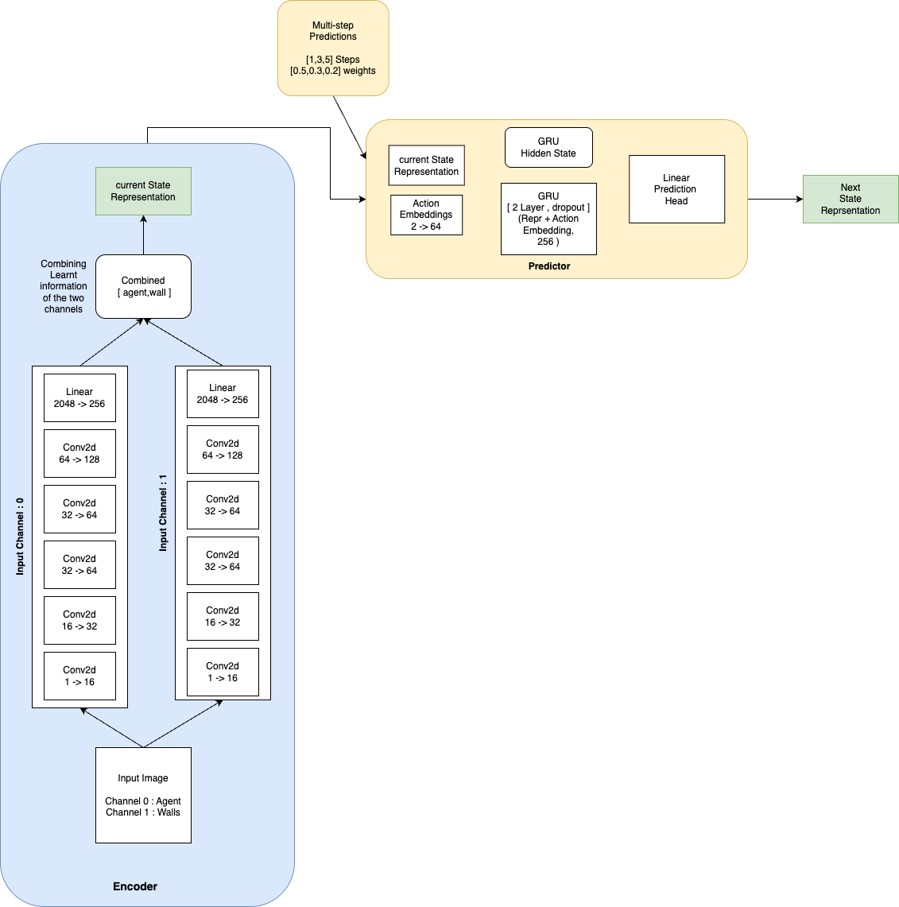

# Multi-Horizon self supervised latent state prediction using JEPA

## Overview

In this project, you will train a JEPA world model on a set of pre-collected trajectories from a toy environment involving an agent in two rooms.

### Our approach

We process the input image through two parallel convolutional pathways: one dedicated to extracting features from the agent channel, and another for the wall configuration channel. 
The outputs from both streams are then concatenated and passed through a linear layer to create the state representation.

Here we enhance our original architecture for multistep prediction, the previous approach was designed to be accurate in one step ahead prediction at each point, here we try to enhance the model to be accurate on future horizons.

The models maintains and passes the GRU’s hidden state between the steps and allows the network build a memory of the trajectory and loss is applied as weight average towards being correct in the future trying to make learning more error.
Instead of comparing every prediction to its ground truth equally, we apply VICReg only at specific steps, with weights. At steps [1,3,5,] -> horizon weights [0.5,0.3,0.2]

\\probe_normal val loss: 2.036336898803711
\\probe_wall val loss: 5.650292873382568
\\wall_other val loss: 6.919018745422363
\\expert val loss: 7.305054187774658
\\trainable parameters of your model 1,885,632

simpler approach on [https://github.com/Tulsani/JEPA-MPC/tree/ftr/walls-dont-move]

### JEPA

Joint embedding prediction architecture (JEPA) is an energy based architecture for self supervised learning first proposed by [LeCun (2022)]. Essentially, it works by asking the model to predict its own representations of future observations.

More formally, in the context of this problem, given an *agent trajectory* $\tau$, *i.e.* an observation-action sequence $\tau = (o_0, u_0, o_1, u_1, \ldots, o_{N-1}, u_{N-1}, o_N)$ , we specify a recurrent JEPA architecture as:

$$
\begin{align}
\text{Encoder}:   &\tilde{s}\_0 = s\_0 = \text{Enc}\_\theta(o_0) \\
\text{Predictor}: &\tilde{s}\_n = \text{Pred}\_\phi(\tilde{s}\_{n-1}, u\_{n-1})
\end{align}
$$

Where $\tilde{s}_n$ is the predicted state at time index $n$, and $s_n$ is the encoder output at time index $n$.

The architecture may also be teacher-forcing (non-recurrent):

$$
\begin{align}
\text{Encoder}:   &s\_n = \text{Enc}\_\theta(o_n) \\
\text{Predictor}: &\tilde{s}\_n = \text{Pred}\_\phi(s\_{n-1}, u\_{n-1})
\end{align}
$$

The JEPA training objective would be to minimize the energy for the observation-action sequence $\tau$, given to us by the sum of the distance between predicted states $\tilde{s}\_n$ and the target states $s'\_n$, where:

$$
\begin{align}
\text{Target Encoder}: &s'\_n = \text{Enc}\_{\psi}(o_n) \\
\text{System energy}:  &F(\tau) = \sum\_{n=1}^{N}D(\tilde{s}\_n, s'\_n)
\end{align}
$$

Where the Target Encoder $\text{Enc}\_\psi$ may be identical to Encoder $\text{Enc}\_\theta$ ([VicReg](https://arxiv.org/pdf/2105.04906), [Barlow Twins](https://arxiv.org/pdf/2103.03230)), or not ([BYOL](https://arxiv.org/pdf/2006.07733))

$D(\tilde{s}\_n, s'\_n)$ is some "distance" function. However, minimizing the energy naively is problematic because it can lead to representation collapse (why?). There are techniques (such as ones mentioned above) to prevent this collapse by adding regularisers, contrastive samples, or specific architectural choices. Feel free to experiment.

Here's a diagram illustrating a recurrent JEPA for 4 timesteps:

### Environment and data set

The dataset consists of random trajectories collected from a toy environment consisting of an agent (dot) in two rooms separated by a wall. There's a door in a wall.  The agent cannot travel through the border wall or middle wall (except through the door). Different trajectories may have different wall and door positions. Thus your JEPA model needs to be able to perceive and distinguish environment layouts. Two training trajectories with different layouts are depicted below.

### Competition Task

Our task is to implement and train a JEPA architecture on a dataset of 2.5M frames of exploratory trajectories (see images above). Then, your model will be evaluated based on how well the predicted representations will capture the true $(x, y)$ coordinate of the agent we'll call $(y\_1,y\_2)$. 

Here are the constraints:
* It has to be a JEPA architecture - namely you have to train it by minimizing the distance between predictions and targets in the *representation space*, while preventing collapse.
* You can try various methods of preventing collapse, **except** image reconstruction. That is - you cannot reconstruct target images as a part of your objective, such as in the case of [MAE](https://arxiv.org/pdf/2111.06377).
* You have to rely only on the provided data in folder `/scratch/DL25SP/train`. However you are allowed to apply image augmentation.

**Failing to meet the above constraints will result in deducted points or even zero points**

### Evaluation
How do we evaluate the quality of our encoded and predicted representations?

One way to do it is through probing - we can see how well we can extract certain ground truth informations from the learned representations. In this particular setting, we will unroll the JEPA world model recurrently $N$ times into the future through the same process as recurrent JEPA described earlier, conditioned on initial observation $o_0$ and action sequence $u\_0, u\_1, \ldots, u\_{N-1}$ jointnly called $x$, generating predicted representations $\tilde{s}\_1, \tilde{s}\_2, \tilde{s}\_3, \ldots, \tilde{s}\_N$. Then, we will train a 2-layer FC to extract the ground truth agent $y = (y\_1,y\_2)$ coordinates from these predicted representations:

$$
\begin{align}
F(x,y)          &= \sum_{n=1}^{N} C[y\_n, \text{Prober}(\tilde{s}\_n)]\\
C(y, \tilde{y}) &= \lVert y - \tilde{y} \rVert _2^2
\end{align}
$$

The smaller the MSE loss on the probing validation dataset, the better our learned representations are at capturing the particular information we care about - in this case the agent location. (We can also probe for other things such as wall or door locations, but we only focus on agent location here).

The evaluation code is already implemented, so you just need to plug in your trained model to run it.

The evaluation script will train the prober on 170k frames of agent trajectories. The first validation set contains similar trajectories from the training set, while the second consists of trajectories with agent running straight towards the wall and sometimes door, this tests how well your model is able to learn the dynamics of stopping at the wall.

There are two other validation sets that are not released but will be used to test how good your model is for long-horizon predictions, and how well your model generalize to unseen novel layouts (detail: during training we exclude the wall from showing up at certain range of x-axes, we want to see how well your model performs when the wall is placed at those x-axes).

### Competition criteria
Each team will be evaluated on $N=5$ criterias:

1. MSE error on `probe_normal`. **Weight** 1
2. MSE error on `probe_wall`. **Weight** 1
3. MSE error on long horizon probing test. **Weight** 1
4. MSE error on out of domain wall probing test. **Weight** 1
5. Parameter count of your model (less parameters --> more points).

The teams are first scorded according to each criteria $C\_n$ independently. A particular team's overall score $S$ is the weighted sum of the 5 criteria:

$$
S = \sum\_{n=1}^N w_nC\_n
$$

The exact formula of the parameter count will be determined at a later date.

### Training
keeping things simple `python train.py`

### Competition Evaluation
The probing evaluation is already implemented for you. It's inside `main.py`. You just need to add change some code marked by #TODOs, namely initialize, load your model. You can also change how your model handle forward pass marked by #TODOs inside `evaluator.py`. **DO NOT** change any other parts of `main.py` and `evaluator.py`.

Just run `python main.py` to evaluate your model. 

There will be a total of **four** evaluation settings for this project. 

